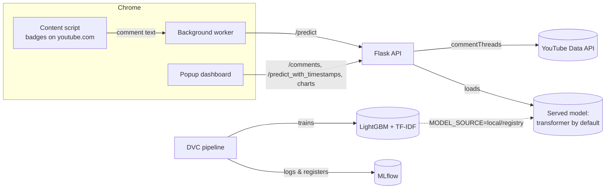

# YouTube Viewer Sentiment Analyzer

A Chrome extension that reads the comments on any YouTube video and shows how viewers feel about it:
the share of positive, neutral and negative comments, a trend over time, a word cloud, and a sentiment
badge on every comment on the page.

Predictions come from a pretrained multilingual model trained on social media text, so emoji, slang,
hyperbole and Hinglish are read correctly. The course's own LightGBM + TF-IDF classifier is still built
by a DVC pipeline, tracked and registered in MLflow, and can be served instead with one environment
variable. The API runs in Docker and deploys to Google Cloud Run through GitHub Actions.

Based on the [YouTube Sentiment Insights course](https://www.youtube.com/watch?v=gwNPV882tkc) and its
[reference repo](https://github.com/entbappy/End-to-end-Youtube-Sentiment).

## How it works



## Why the served model is not the course's LightGBM

Tested on a real video, the course's model called enthusiastic comments negative. Its vocabulary is
1,000 words learned from Indian political Reddit threads, so "success" was not even in it, and a
bag-of-words model reads "killed it", "insane" and "lost interest in any other movie" literally.

Measured on 16 hand-labelled comments (the failing ones plus clear positives, negatives and questions):

| | Correct | Emoji only ("🔥🔥🔥") | Hinglish ("bakwas video") |
|---|---|---|---|
| LightGBM + TF-IDF | 5 / 16 | Neutral ✗ | Neutral ✗ |
| `twitter-xlm-roberta-base-sentiment` | 14 / 16 | Positive ✓ | Negative ✓ |

The transformer classifies 500 comments in about 16 seconds on a laptop CPU (32 ms each). It still
misses praise phrased as criticism, such as "completely lost interest in any other movie".

The LightGBM pipeline is kept: it is the course's subject, it trains in a minute, and it stays
available through `MODEL_SOURCE`.

### Known limitation

Measured again on 300 real comments from a motivational video, with 59 of them hand-labelled, the
transformer is much better than LightGBM but still wrong often. It calls 24% of the comments negative
where the true share is about 3%: of 22 comments it labelled negative, 1 actually was.

It scores the emotional tone of the words rather than the commenter's attitude to the video, and on
emotional content those are opposites:

| Comment | Reality | Model |
|---|---|---|
| "I'm literally crying😭😭😭😭" | praise | negative |
| "The amount of goosebumps I got... is insaneee" | praise | negative |
| "i am suffering from social anxiety, i wish i had your confidence, i just love you" | praise | negative |

Two cheap mitigations, neither applied: predicting negative only above 80% confidence lifts accuracy on
that labelled set from 51% to 66%, and the English-only `twitter-roberta-base-sentiment-latest` reaches
71%. On the same set, calling every comment positive scores 81% — so these models add little on this
kind of video.

Fixing it properly takes a model that reasons about intent (an LLM reading each comment), or a
classifier trained on YouTube comments labelled for attitude rather than mood.

## Changes from the reference repo

**Bugs fixed**

| Problem in the original | Fix |
|---|---|
| `requirements.txt` saved as UTF-16, missing `scikit-learn` and `pyyaml` | Rewritten; split into runtime (`requirements.txt`) and dev (`requirements-dev.txt`) |
| A YouTube API key hard-coded in `popup.js`, readable by anyone who installs the extension | The API server calls YouTube with a key from its environment (`/comments` endpoint) |
| Comment text inserted with `innerHTML` (a comment could inject HTML into the popup) | All comment text rendered with `textContent` |
| MLflow and API URLs hard-coded to the author's EC2 servers | `MLFLOW_TRACKING_URI` env var; API URL set on the extension's options page |
| API crashed in Docker: NLTK data never downloaded; LightGBM missing `libgomp1` | Both installed in the image |
| Flask served with `debug=True` on `0.0.0.0` (the debugger allows remote code execution) | Debug off; gunicorn in Docker |
| Preprocessing copy-pasted into the pipeline and the API, free to drift apart | One shared `src/data/text_cleaning.py` |
| Pipeline stages printed errors and exited 0, so `dvc repro` "succeeded" with nothing produced | Stages re-raise |
| Experiment 6 fitted TF-IDF and SMOTE on the whole dataset before splitting (test data leaked into training) | Split first; tune on a validation split; test set used once |
| LightGBM `subsample` tuned without `subsample_freq`, so it had no effect | `subsample_freq=1` |
| XGBoost tuning interrupted at trial 13; other algorithms from the video missing | All algorithms run with 30 Optuna trials each |
| Max features switched silently between 1,000 and 10,000 across experiments | 1,000 throughout, as experiment 3 concluded |
| Deprecated MLflow model stages | Registry alias `staging` |
| `python:3.11-slim-buster` base image (end-of-life, apt repos gone) | `python:3.11-slim-bookworm` |
| Deployed to an always-on EC2 instance, with long-lived AWS access keys stored in GitHub secrets | Google Cloud Run, which scales to zero; GitHub authenticates through Workload Identity Federation and stores no keys |

**Features added** (shown in the video but not in the repo)

- Coloured badge on each comment on the YouTube page: green positive, blue neutral, red negative.
- Clickable positive / neutral / negative boxes in the popup that list the matching comments.

## Experiment results

The notebooks reproduce the course's experiments, on the Reddit test split. Each answer below is what
the measurements support, not what the video asserts:

| # | Question | Answer |
|---|---|---|
| 1 | Baseline | Bag of words + Random Forest: 65.1% accuracy, but negative-class recall 0.01 |
| 2 | Bag of words or TF-IDF, and which n-grams? | All six combinations land within 0.9 points (64.4–65.3%) — effectively a tie |
| 3 | How many features? | 1,000 wins clearly: 66.2% accuracy and negative recall 0.13, against 0.01 at 10,000 |
| 4 | Which imbalance fix? | All but one land near 67% and lift negative recall to ~0.45; SMOTE-ENN collapses to 43% |
| 5 | Which algorithm? (30 Optuna trials each) | XGBoost 78.6%, logistic regression 77.4%, Naive Bayes 71.8%, random forest 69.3%, decision tree 66.2%, KNN 48.7% |
| 6 | LightGBM, tuned properly (100 trials) | **78.7%**, negative recall 0.61 |
| 7 | Does stacking help? | No: 76.8%, below LightGBM alone |

Experiments 5 and 6 tune against a validation split carved out of the training data, so the test set is
scored once. The original notebooks tuned on the test set itself and, in experiment 6, fitted TF-IDF and
SMOTE before splitting, which leaked test rows into training.

Remember that these numbers describe the Reddit data, not YouTube comments — see the known limitation above.

## Project layout

```
├── app.py                        Flask API
├── deploy/gcp_setup.sh           one-time Google Cloud setup for deployment
├── dvc.yaml, params.yaml         DVC pipeline and its parameters
├── src/
│   ├── data/                     ingestion, preprocessing, shared text cleaning
│   └── model/                    training, evaluation (MLflow), registration
├── notebooks/                    EDA and experiments 1–7
├── scripts/bake_model.py         saves a single copy of the transformer for the Docker image
├── tests/                        pytest suite for the API and preprocessing
├── yt-chrome-plugin-frontend/    Chrome extension (Manifest V3)
└── Dockerfile
```

## Run it locally

Prerequisites: [uv](https://docs.astral.sh/uv/), Git, Google Chrome. Windows commands shown; on macOS/Linux
use `.venv/bin/` instead of `.venv\Scripts\`.

**1. Environment**

```bash
uv venv --python 3.11 .venv
uv pip install --python .venv -r requirements-dev.txt
```

Activate it for the steps below (`.venv\Scripts\activate` in cmd, `source .venv/Scripts/activate` in Git Bash).
DVC runs `python` from your PATH, so the venv must be active for `dvc repro`.

**2. MLflow tracking server** (separate terminal, leave it running)

```bash
mlflow server --host 127.0.0.1 --port 5000 --backend-store-uri sqlite:///mlflow.db --artifacts-destination ./mlartifacts
```

Open http://127.0.0.1:5000 to browse experiments and the model registry.

**3. Train**

```bash
dvc repro
```

This downloads the data, preprocesses it, trains LightGBM, logs the evaluation to MLflow, registers the
model as `yt_chrome_plugin_model@staging`, and writes `lgbm_model.pkl` and `tfidf_vectorizer.pkl`.
`dvc dag` shows the stages.

The notebooks in `notebooks/` reproduce the experiments that chose these settings. Run them in order;
experiments 5 and 6 (hyperparameter tuning) take hours.

**4. YouTube API key**

In the [Google Cloud Console](https://console.cloud.google.com/): create a project, enable
**YouTube Data API v3**, then *Credentials → Create credentials → API key*. Restrict the key to the
YouTube Data API. Then:

```bash
copy .env.example .env
```

and paste the key after `YOUTUBE_API_KEY=` in `.env`. Never commit `.env`.

**5. API**

```bash
python app.py
```

The API listens on http://localhost:8080. On first start it downloads the transformer (~1.1 GB) into
the Hugging Face cache; later starts read it from disk. `MODEL_SOURCE` in `.env` chooses what serves
predictions:

| `MODEL_SOURCE` | Serves |
|---|---|
| `transformer` (default) | Pretrained multilingual model named by `TRANSFORMER_MODEL` |
| `local` | `lgbm_model.pkl` + `tfidf_vectorizer.pkl` from `dvc repro` |
| `registry` | The MLflow-registered LightGBM model and the vectorizer logged with it |

**6. Extension**

1. Open `chrome://extensions` and turn on **Developer mode**.
2. **Load unpacked** → select the `yt-chrome-plugin-frontend` folder.
3. Open a YouTube video and click the extension icon.

After editing extension files, press the reload icon on its card in `chrome://extensions`.
Use the extension's **Settings** to change the API URL (e.g. to your Cloud Run URL) or hide the in-page badges.

**7. Tests**

```bash
pytest
```

## Docker

```bash
docker build -t yt-sentiment .
docker run --rm -p 8080:8080 --env-file .env yt-sentiment
```

Run `dvc repro` first: the image copies `lgbm_model.pkl` and `tfidf_vectorizer.pkl` for the `local`
model source.

The first build takes about 5 minutes. It installs CPU-only PyTorch and bakes one copy of the
transformer into the image: the Hub repo ships the weights twice, and `scripts/bake_model.py` keeps
a single copy. Measured on the built image:

| | |
|---|---|
| Image size | 1.45 GB by `docker image inspect` (Docker Desktop's image list shows ~4.5 GB because it counts compressed and unpacked copies) |
| Ready after `docker run` | ~10 seconds |
| Memory while serving | ~1.5 GB |
| Network needed to start | None: the model is baked in and Hugging Face offline mode is on |
| Runs as | `appuser`, not root |

## Deploy to Google Cloud Run with CI/CD

Every push to `main` runs [`.github/workflows/cicd.yaml`](.github/workflows/cicd.yaml):

1. **Continuous integration**: runs the test suite and syntax-checks the extension.
2. **Continuous delivery**: pulls the trained model from the DVC remote on Cloud Storage, builds the
   Docker image, and pushes it to Artifact Registry tagged with the commit SHA.
3. **Continuous deployment**: deploys that image to Cloud Run and calls `/health` on the result.

GitHub stores no Google credentials. Each run trades a short-lived GitHub token for temporary access
through Workload Identity Federation, and only your repository is allowed to.

### What it costs

Cloud Run scales to zero, so a personal project normally stays inside Google's always-free tier:
180,000 vCPU-seconds, 360,000 GB-seconds and 2 million requests a month. The workflow deploys with
2 vCPUs, 2 GiB of memory, `--min-instances=0` and `--max-instances=2`.

- **Free**: Cloud Run at personal volume, the DVC bucket (5 GB free in `us-central1`), the secret.
- **A few cents a month**: Artifact Registry storage beyond its free 0.5 GB, since the image is 1.45 GB.
- **A slow first request after idle**: a fresh instance starts and loads the model before answering.

Raising `--min-instances` above 0 removes that delay but bills around the clock. Set a budget alert on
the billing account (*Billing → Budgets & alerts*) before you deploy.

### One-time setup

1. **Google Cloud project with billing.** Use the project that holds your YouTube API key, or create
   one. Link a billing account and add the budget alert.
2. **GitHub repository.** Create it and push this project to it.
3. **Cloud resources.** Open [Cloud Shell](https://shell.cloud.google.com), clone your repository, and
   run:
   ```bash
   PROJECT_ID=your-project GITHUB_REPO=your-user/your-repo bash deploy/gcp_setup.sh
   ```
   It enables the APIs and creates the Artifact Registry repository, the DVC bucket, a runtime service
   account that can only read the YouTube key, a deployer service account for GitHub Actions, and a
   Workload Identity Federation pool that trusts only your repository. It asks for your YouTube API key
   once and stores it in Secret Manager. Re-running it is safe.
4. **Repository variables.** The script prints seven values. Add each one under *Settings → Secrets and
   variables → Actions → Variables*; none of them are secret. Your YouTube API key is not one of them: it
   stays in Secret Manager. Never put a key in a repository variable, because variables appear in the
   public workflow logs.
5. **Upload the model to the DVC remote** from this project on your machine. This needs the
   [gcloud CLI](https://cloud.google.com/sdk/docs/install), signed in once:
   ```bash
   gcloud auth application-default login
   dvc remote add -d -f storage gs://your-project-dvc/dvc
   dvc push
   ```
   Commit the updated `.dvc/config`. Run `dvc push` again after every retrain.
6. **Push to `main`.** When the workflow finishes, its last step prints the service URL. Open the
   extension's **Settings**, set the API URL to it, and accept the permission prompt.

## API

| Method | Path | Body / query | Returns |
|---|---|---|---|
| GET | `/health` | | `{status, model, youtube_api_key_configured}` |
| GET | `/comments` | `?video_id=…&max_comments=500` | Top-level comments (most relevant first) |
| POST | `/predict` | `{"comments": ["text", …]}` | `[{comment, sentiment}]` |
| POST | `/predict_with_timestamps` | `{"comments": [{"text", "timestamp"}]}` | `[{comment, sentiment, timestamp}]` |
| POST | `/generate_chart` | `{"sentiment_counts": {"1": n, "0": n, "-1": n}}` | PNG pie chart |
| POST | `/generate_wordcloud` | `{"comments": ["text", …]}` | PNG word cloud |
| POST | `/generate_trend_graph` | `{"sentiment_data": [{"timestamp", "sentiment"}]}` | PNG line chart |

Sentiment is `1` positive, `0` neutral, `-1` negative. Requests are capped at 1,000 comments.

## A note on the training data

The LightGBM path is trained on a public Reddit dataset, mostly Indian political discussion, used as a
stand-in for YouTube comments. That mismatch is why the served model is the pretrained one instead.
To make the LightGBM path work on your own channel, collect and label its comments and retrain: the
pipeline is unchanged, only the data source in `src/data/data_ingestion.py`.
