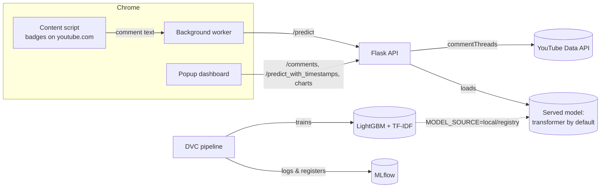

# YouTube Viewer Sentiment Analyzer

A Chrome extension that reads the comments on any YouTube video and shows how viewers feel about it:
the share of positive, neutral and negative comments, a trend over time, a word cloud, and a sentiment
badge on every comment on the page.

Predictions come from a pretrained multilingual model trained on social media text, so emoji, slang,
hyperbole and Hinglish are read correctly. The course's own LightGBM + TF-IDF classifier is still built
by a DVC pipeline, tracked and registered in MLflow, and can be served instead with one environment
variable. The API runs in Docker and deploys to AWS EC2 through GitHub Actions.

Based on the [YouTube Sentiment Insights course](https://www.youtube.com/watch?v=gwNPV882tkc) and its
[reference repo](https://github.com/entbappy/End-to-end-Youtube-Sentiment).

## How it works



## Why the served model is not the course's LightGBM

Tested on a real video, the course's model called enthusiastic comments negative. Its vocabulary is
1,000 words learned from Indian political Reddit threads, so "success" was not even in it, and a
bag-of-words model reads "killed it", "insane" and "lost interest in any other movie" literally.

Measured on 16 hand-labelled comments (the failing ones plus clear positives, negatives and questions):

| | Correct | Emoji only ("🔥🔥🔥") | Hinglish ("bakwas video") |
|---|---|---|---|
| LightGBM + TF-IDF | 5 / 16 | Neutral ✗ | Neutral ✗ |
| `twitter-xlm-roberta-base-sentiment` | 14 / 16 | Positive ✓ | Negative ✓ |

The transformer classifies 500 comments in about 16 seconds on a laptop CPU (32 ms each). It still
misses praise phrased as criticism, such as "completely lost interest in any other movie".

The LightGBM pipeline is kept: it is the course's subject, it trains in a minute, and it stays
available through `MODEL_SOURCE`.

## Changes from the reference repo

**Bugs fixed**

| Problem in the original | Fix |
|---|---|
| `requirements.txt` saved as UTF-16, missing `scikit-learn` and `pyyaml` | Rewritten; split into runtime (`requirements.txt`) and dev (`requirements-dev.txt`) |
| A YouTube API key hard-coded in `popup.js`, readable by anyone who installs the extension | The API server calls YouTube with a key from its environment (`/comments` endpoint) |
| Comment text inserted with `innerHTML` (a comment could inject HTML into the popup) | All comment text rendered with `textContent` |
| MLflow and API URLs hard-coded to the author's EC2 servers | `MLFLOW_TRACKING_URI` env var; API URL set on the extension's options page |
| API crashed in Docker: NLTK data never downloaded; LightGBM missing `libgomp1` | Both installed in the image |
| Flask served with `debug=True` on `0.0.0.0` (the debugger allows remote code execution) | Debug off; gunicorn in Docker |
| Preprocessing copy-pasted into the pipeline and the API, free to drift apart | One shared `src/data/text_cleaning.py` |
| Pipeline stages printed errors and exited 0, so `dvc repro` "succeeded" with nothing produced | Stages re-raise |
| Experiment 6 fitted TF-IDF and SMOTE on the whole dataset before splitting (test data leaked into training) | Split first; tune on a validation split; test set used once |
| LightGBM `subsample` tuned without `subsample_freq`, so it had no effect | `subsample_freq=1` |
| XGBoost tuning interrupted at trial 13; other algorithms from the video missing | All algorithms run with 30 Optuna trials each |
| Max features switched silently between 1,000 and 10,000 across experiments | 1,000 throughout, as experiment 3 concluded |
| Deprecated MLflow model stages | Registry alias `staging` |
| `python:3.11-slim-buster` base image (end-of-life, apt repos gone) | `python:3.11-slim-bookworm` |

**Features added** (shown in the video but not in the repo)

- Coloured badge on each comment on the YouTube page: green positive, blue neutral, red negative.
- Clickable positive / neutral / negative boxes in the popup that list the matching comments.

## Project layout

```
├── app.py                        Flask API
├── dvc.yaml, params.yaml         DVC pipeline and its parameters
├── src/
│   ├── data/                     ingestion, preprocessing, shared text cleaning
│   └── model/                    training, evaluation (MLflow), registration
├── notebooks/                    EDA and experiments 1–7
├── tests/                        pytest suite for the API and preprocessing
├── yt-chrome-plugin-frontend/    Chrome extension (Manifest V3)
└── Dockerfile
```

## Run it locally

Prerequisites: [uv](https://docs.astral.sh/uv/), Git, Google Chrome. Windows commands shown; on macOS/Linux
use `.venv/bin/` instead of `.venv\Scripts\`.

**1. Environment**

```bash
uv venv --python 3.11 .venv
uv pip install --python .venv -r requirements-dev.txt
```

Activate it for the steps below (`.venv\Scripts\activate` in cmd, `source .venv/Scripts/activate` in Git Bash).
DVC runs `python` from your PATH, so the venv must be active for `dvc repro`.

**2. MLflow tracking server** (separate terminal, leave it running)

```bash
mlflow server --host 127.0.0.1 --port 5000 --backend-store-uri sqlite:///mlflow.db --artifacts-destination ./mlartifacts
```

Open http://127.0.0.1:5000 to browse experiments and the model registry.

**3. Train**

```bash
dvc repro
```

This downloads the data, preprocesses it, trains LightGBM, logs the evaluation to MLflow, registers the
model as `yt_chrome_plugin_model@staging`, and writes `lgbm_model.pkl` and `tfidf_vectorizer.pkl`.
`dvc dag` shows the stages.

The notebooks in `notebooks/` reproduce the experiments that chose these settings. Run them in order;
experiments 5 and 6 (hyperparameter tuning) take hours.

**4. YouTube API key**

In the [Google Cloud Console](https://console.cloud.google.com/): create a project, enable
**YouTube Data API v3**, then *Credentials → Create credentials → API key*. Restrict the key to the
YouTube Data API. Then:

```bash
copy .env.example .env
```

and paste the key after `YOUTUBE_API_KEY=` in `.env`. Never commit `.env`.

**5. API**

```bash
python app.py
```

The API listens on http://localhost:8080. On first start it downloads the transformer (~1.1 GB) into
the Hugging Face cache; later starts read it from disk. `MODEL_SOURCE` in `.env` chooses what serves
predictions:

| `MODEL_SOURCE` | Serves |
|---|---|
| `transformer` (default) | Pretrained multilingual model named by `TRANSFORMER_MODEL` |
| `local` | `lgbm_model.pkl` + `tfidf_vectorizer.pkl` from `dvc repro` |
| `registry` | The MLflow-registered LightGBM model and the vectorizer logged with it |

**6. Extension**

1. Open `chrome://extensions` and turn on **Developer mode**.
2. **Load unpacked** → select the `yt-chrome-plugin-frontend` folder.
3. Open a YouTube video and click the extension icon.

After editing extension files, press the reload icon on its card in `chrome://extensions`.
Use the extension's **Settings** to change the API URL (e.g. to your EC2 server) or hide the in-page badges.

**7. Tests**

```bash
pytest
```

## Docker

```bash
docker build -t yt-sentiment .
docker run --rm -p 8080:8080 --env-file .env yt-sentiment
```

Run `dvc repro` first: the image copies `lgbm_model.pkl` and `tfidf_vectorizer.pkl` for the `local`
model source. The build installs CPU-only PyTorch and bakes the transformer into the image, so it
downloads about 2 GB and the finished image is roughly 2.5 GB.

## Deploy to AWS with CI/CD

Every push to `main` runs [`.github/workflows/cicd.yaml`](.github/workflows/cicd.yaml):

1. **Continuous integration**: runs the test suite and syntax-checks the extension.
2. **Continuous delivery**: pulls the trained model from the DVC remote on S3, builds the Docker image,
   and pushes it to ECR tagged with the commit SHA and `latest`.
3. **Continuous deployment**: a self-hosted GitHub runner on EC2 pulls that image and replaces the
   running container on port 8080.

One-time setup:

1. **S3 bucket for DVC.** Create a bucket (names are global, e.g. `yt-sentiment-dvc-<yourname>`), then
   from the project, with your AWS credentials configured locally (`aws configure`):
   ```bash
   dvc remote add -d storage s3://<bucket>/dvc
   dvc push
   ```
   Commit the updated `.dvc/config`. Run `dvc push` again after every retrain.
2. **IAM user for GitHub Actions** with `AmazonEC2ContainerRegistryFullAccess`, plus `s3:GetObject` and
   `s3:ListBucket` on the DVC bucket. Create an access key for it. It needs nothing else.
3. **ECR repository**, e.g. `yt-sentiment`.
4. **EC2 instance**: Ubuntu 24.04, t2.medium or larger, 30 GB disk. In its security group, allow inbound
   TCP 8080 (ideally from your own IP only; the API has no login, so anyone who can reach it can spend
   your YouTube API quota). Then install Docker on it:
   ```bash
   curl -fsSL https://get.docker.com -o get-docker.sh && sudo sh get-docker.sh
   sudo usermod -aG docker ubuntu && newgrp docker
   ```
5. **Self-hosted runner.** In the GitHub repo: *Settings → Actions → Runners → New self-hosted runner →
   Linux*, and run the commands it shows on the EC2 instance. Then run `sudo ./svc.sh install && sudo ./svc.sh start`
   in the runner folder so it keeps running after you disconnect and across reboots.
6. **Repository secrets** (*Settings → Secrets and variables → Actions*):

   | Secret | Example |
   |---|---|
   | `AWS_ACCESS_KEY_ID` | from step 2 |
   | `AWS_SECRET_ACCESS_KEY` | from step 2 |
   | `AWS_REGION` | `us-east-1` |
   | `ECR_REPOSITORY_NAME` | `yt-sentiment` |
   | `YOUTUBE_API_KEY` | your YouTube Data API key |

7. **Push to `main`.** When the workflow finishes, open the extension's **Settings**, set the API URL to
   `http://<EC2 public IP>:8080`, and allow the permission prompt.

EC2 bills by the hour while the instance runs: stop it when you're not using it, and terminate it
(plus delete the ECR images and S3 bucket) when you're done.

## API

| Method | Path | Body / query | Returns |
|---|---|---|---|
| GET | `/health` | | `{status, model, youtube_api_key_configured}` |
| GET | `/comments` | `?video_id=…&max_comments=500` | Top-level comments (most relevant first) |
| POST | `/predict` | `{"comments": ["text", …]}` | `[{comment, sentiment}]` |
| POST | `/predict_with_timestamps` | `{"comments": [{"text", "timestamp"}]}` | `[{comment, sentiment, timestamp}]` |
| POST | `/generate_chart` | `{"sentiment_counts": {"1": n, "0": n, "-1": n}}` | PNG pie chart |
| POST | `/generate_wordcloud` | `{"comments": ["text", …]}` | PNG word cloud |
| POST | `/generate_trend_graph` | `{"sentiment_data": [{"timestamp", "sentiment"}]}` | PNG line chart |

Sentiment is `1` positive, `0` neutral, `-1` negative. Requests are capped at 1,000 comments.

## A note on the training data

The LightGBM path is trained on a public Reddit dataset, mostly Indian political discussion, used as a
stand-in for YouTube comments. That mismatch is why the served model is the pretrained one instead.
To make the LightGBM path work on your own channel, collect and label its comments and retrain: the
pipeline is unchanged, only the data source in `src/data/data_ingestion.py`.
